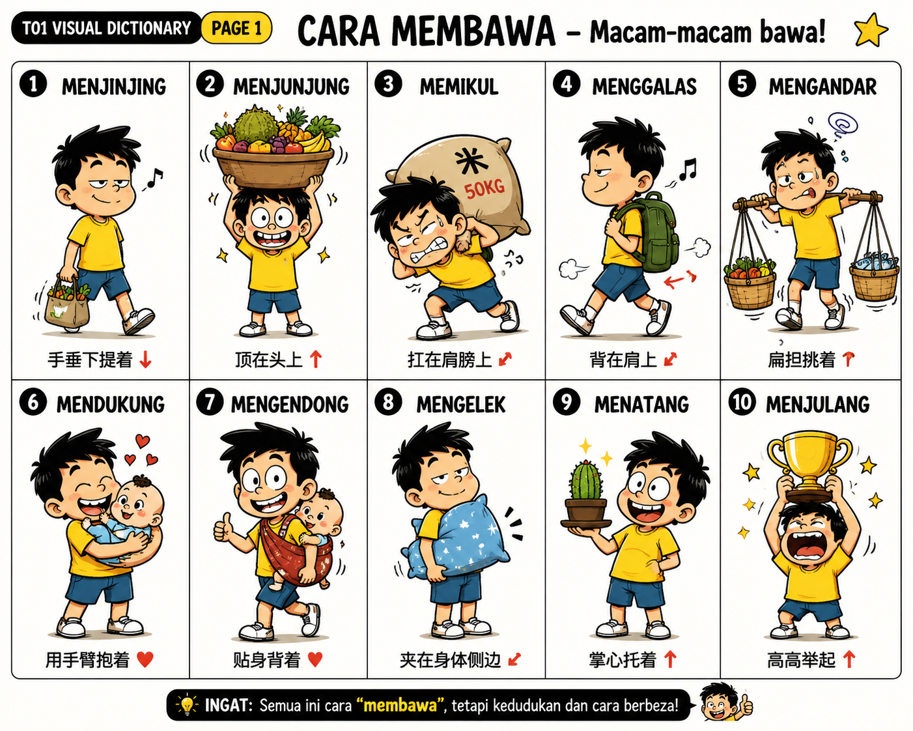
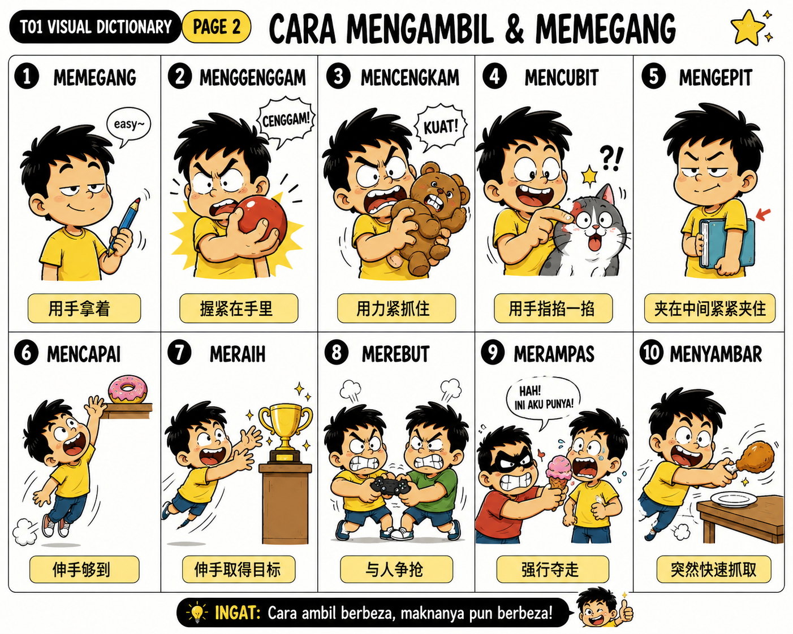
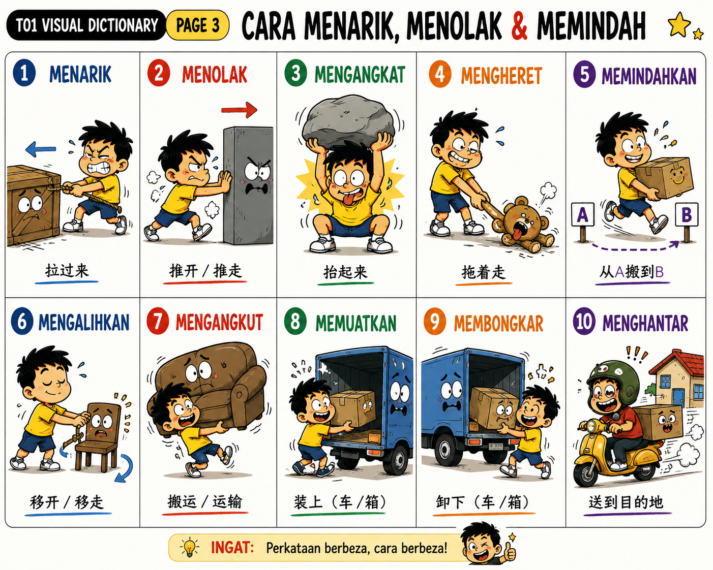
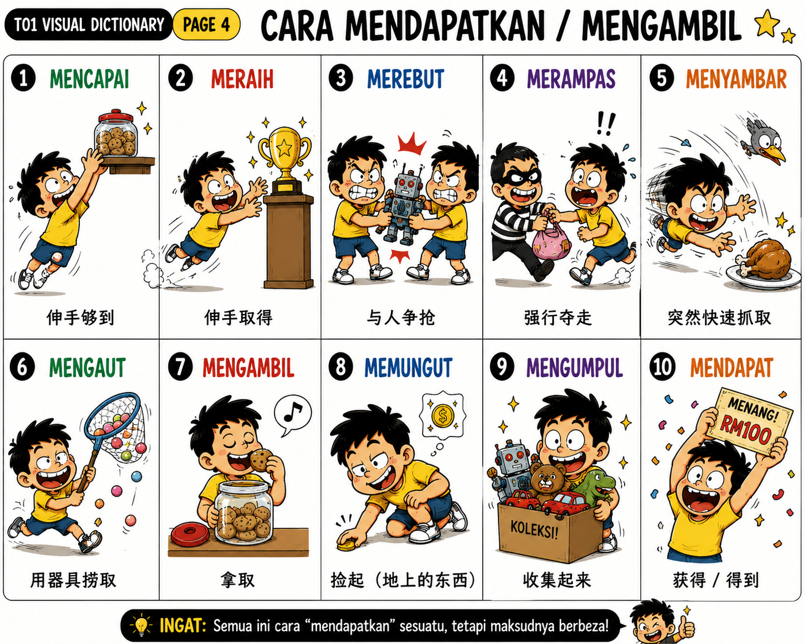
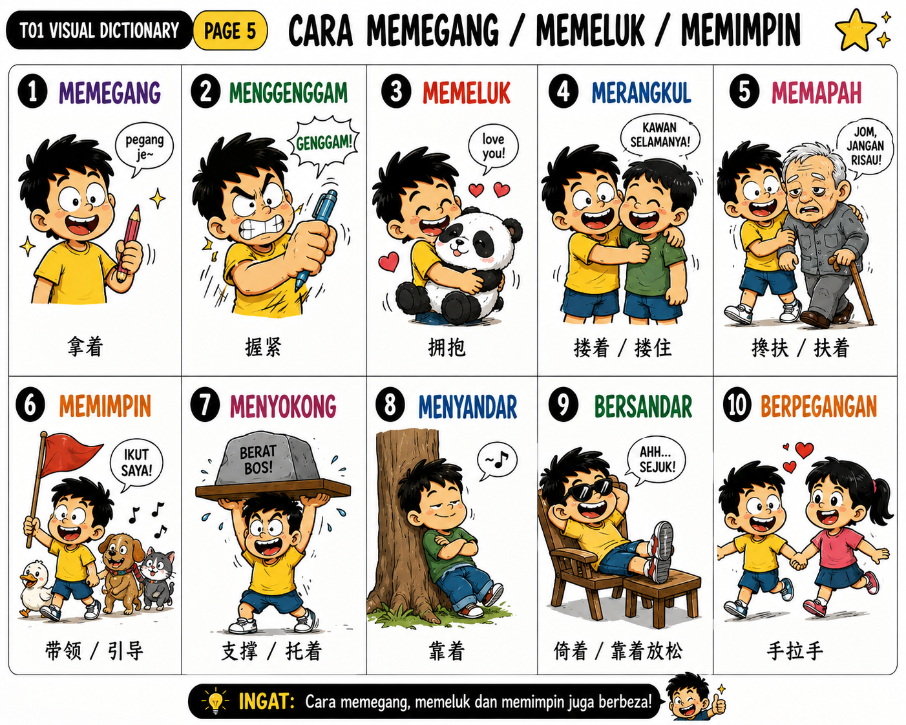

# T01 — Membawa, Mengambil & Mengalihkan

BM Master Vocabulary Database — 小学至中学精准词汇系统。

## A. Cara Membawa

| ID | Perkataan | 中文精准义 | 核心判断 | Level |
|---|---|---|---|---|
| T01-001 | membawa | 携带、带着 | 泛指带着移动 | L1 |
| T01-002 | menjinjing | 手垂下提着 | 手向下 | L2 |
| T01-003 | membimbit | 手提着 | 手/手指提 | L2 |
| T01-004 | menjunjung | 顶在头上 | 头顶 | L2 |
| T01-005 | memikul | 肩扛 | 肩膀承重 | L2 |
| T01-006 | menggalas | 肩背、肩扛 | 肩部携带 | L2 |
| T01-007 | mengandar | 用扁担挑 | kandar + 肩 | L3 |
| T01-008 | mendukung | 用手臂抱着承托 | 怀抱 + 承重 | L2 |
| T01-009 | mengendong | 贴身背/抱 | 身体承载 | L2 |
| T01-010 | mengelek | 夹在身体侧边携带 | 腋/腰侧 | L3 |
| T01-011 | mengepit | 夹住 | 两者之间 | L2 |
| T01-012 | mencempung | 双臂抱在胸前 | 胸前承抱 | L3 |
| T01-013 | menatang | 掌上托着 | 手掌向上 | L2 |
| T01-014 | menjulang | 高高举起 | 手臂向上 | L2 |
| T01-015 | mengusung | 抬着运送 | 人/重物 | L2 |
| T01-016 | menandu | 用担架等抬运 | tandu | L3 |

## B. Mengambil & Memegang

| ID | Perkataan | 中文精准义 | 核心判断 | Level |
|---|---|---|---|---|
| T01-017 | mengambil | 拿、取 | 从某处取得 | L1 |
| T01-018 | memegang | 拿着、握着 | 保持在手中 | L1 |
| T01-019 | menggenggam | 握在掌中 | 手指合拢 | L2 |
| T01-020 | mencengkam | 紧紧抓住、钳住 | 强力抓紧 | L2 |
| T01-021 | mencubit | 掐、指尖捏 | 指尖夹 | L1 |
| T01-022 | meraih | 伸手取得；获得 | 取得目标 | L2 |
| T01-023 | mencapai | 伸手够到；达到 | 达到目标 | L1–L2 |
| T01-024 | merampas | 强行夺走 | 强制取走 | L2 |
| T01-025 | merebut | 争抢、争夺 | 双方竞争 | L2 |
| T01-026 | menyambar | 突然迅速抓取 | 快 + 突然 | L2 |
| T01-027 | meragut | 猛然夺走、扯走 | 突然强夺 | L3 |

## C. Mengalihkan

| ID | Perkataan | 中文精准义 | 核心判断 | Level |
|---|---|---|---|---|
| T01-028 | menarik | 拉 | 施力拉动 | L1 |
| T01-029 | menolak | 推；拒绝 | 推离/拒绝 | L1 |
| T01-030 | mengheret | 拖着移动 | 接触表面拖 | L2 |
| T01-031 | menyeret | 拖、曳 | 拖行 | L2 |
| T01-032 | mengangkat | 抬起、举起 | 向上/离开原位 | L1 |
| T01-033 | memindahkan | 搬到另一处 | A → B | L1 |
| T01-034 | mengalihkan | 移开、转移 | 改变位置/方向 | L2 |
| T01-035 | mengangkut | 搬运、运输 | A → B运输 | L2 |
| T01-036 | memuatkan | 装入、装载 | 外 → 内 | L2 |
| T01-037 | memunggah | 装卸/搬动货物 | 货运情境 | L3 |
| T01-038 | membongkar | 卸下；拆开 | 内 → 外/拆 | L2 |
| T01-039 | menghantar | 送到目的地 | 人/物 → 目的地 | L1 |
| T01-040 | mengirim | 寄、托送 | 经媒介/他人送 | L2 |

## D. Mendukung & Membantu

| ID | Perkataan | 中文精准义 | 核心判断 | Level |
|---|---|---|---|---|
| T01-041 | memeluk | 拥抱 | 双臂环抱 | L1 |
| T01-042 | merangkul | 搂住、环抱 | 手臂环绕 | L2 |
| T01-043 | memapah | 搀扶 | 支撑行动困难者 | L2 |
| T01-044 | memimpin | 牵领；领导 | 引领 | L1–L2 |
| T01-045 | menyokong | 支撑；支持 | 提供支持 | L2 |
| T01-046 | menampung | 承托、容纳、承担 | 承受 | L2 |
| T01-047 | menahan | 挡住、承受、忍住 | 阻挡/承受 | L2 |

## 小学具体义 → 中学抽象义

- memikul barang → **memikul tanggungjawab**
- mengangkat kotak → **mengangkat martabat**
- menarik tali → **menarik perhatian / minat**
- menolak objek → **menolak cadangan**
- mencapai buku → **mencapai matlamat**
- meraih sesuatu → **meraih kejayaan**
- merebut barang → **merebut peluang**
- mendukung bayi → **mendukung usaha**
- memimpin tangan adik → **memimpin organisasi / negara**
- menyokong dahan → **menyokong cadangan**
- menampung air → **menampung kos**
- menahan pintu → **menahan perasaan**
- mengalihkan objek → **mengalihkan perhatian**
- menggenggam objek → **menggenggam kejayaan**

## Visual Dictionary

### Page 1 — Cara Membawa

### Page 2 — Cara Mengambil & Memegang

### Page 3 — Cara Menarik, Menolak & Memindah

### Page 4 — Cara Mendapatkan / Mengambil

### Page 5 — Cara Memegang / Memeluk / Memimpin

